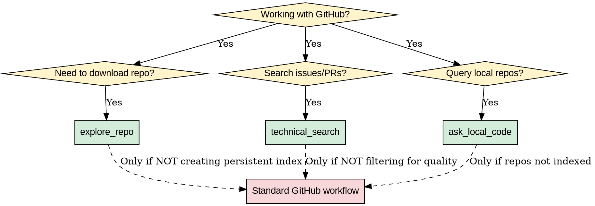

# GitHub Knowledge Base (GitHub-KB)

## Overview

**Transform GitHub from bookmark cemetery to second brain.**

Core principle: **Every clone MUST create persistent index.** When you `explore_repo`, the agent automatically extracts README, technical stack, and generates structured summary in searchable index file. This enables future queries like "What RL repos do I have locally?" to work WITHOUT re-analysis.

Three-layer architecture:
1. **Context Anchor** - Automated repo indexing (explore_repo)
2. **Technical Scout** - Precision issue/code search (technical_search)
3. **Local Knowledge** - Answer from cached code (ask_local_code)

## When to Use



**Use when:**
- Cloning GitHub repos - MUST create index, not just download
- Searching GitHub issues/PRs - filter for solved/quality
- Answering "What repos do I have about X?" - query local index
- Need to reference past repo analysis without re-reading
- Debugging and need to find similar solved issues

**Do NOT use for:**
- Simple one-time code inspection (use Read tool directly)
- Browsing GitHub without intent to build knowledge base
- Projects you'll never reference again

## Quick Reference

| Action | When to Use | Command Pattern |
|--------|-------------|-----------------|
| **explore_repo** | Clone + index new repo | `explore_repo <repo-url> [--target-dir]` |
| **technical_search** | Find issues/code in repo | `technical_search <repo> "query" --type {issues,code} --filter closed` |
| **ask_local_code** | Query indexed repos | `ask_local_code "What repos about <topic>?"` |

## Implementation

### Layer 1: explore_repo - Context Anchor

**What it does:** Clone repo, extract README, analyze tech stack, generate 100-word summary in index file.

**Critical: Without this, repos become "bookmark cemetery" - starred but forgotten.**

```bash
# Usage
explore_repo https://github.com/Vision-CAIR/MiniGPT-4

# Process:
# 1. Clone to ~/github-kb/Vision-CAIR/MiniGPT-4/
# 2. Extract README.md
# 3. Extract requirements.txt OR environment.yml OR pyproject.toml
# 4. Generate CLAUDE.md with:
#    - 100-word summary (what is this? when would I use it?)
#    - Technical stack (key dependencies)
#    - File structure notes (entry points, key modules)
```

**Index file format (CLAUDE.md in repo root):**

```markdown
# MiniGPT-4 - Vision-Language Model

## Summary (100 words)
Vision-language model combining frozen BLIP-2 visual encoder with frozen Vicuna/Llama2 LLM via single projection layer. Two-stage training: pretraining on image-text pairs (Laion/CC), then fine-tuning on conversations. Capable of detailed image description, writing stories about images, problem-solving from images, multi-turn conversation. Use when: experimenting with VLM alignment, low-resource VLM (8-bit quantization), building vision-language chat interfaces.

## Technical Stack
- PyTorch 2.0.0, Transformers 4.30.0
- Gradio 3.47.1 (web interface)
- BitsAndBytes 0.37.0 (8-bit quantization)
- Built on LAVIS framework

## Key Files
- `minigpt4/models/minigpt4.py` - Core model
- `train.py` - Training script
- `demo.py` - Gradio interface

## Tags
vision-language-model, vlm, multimodal, llm, blip-2, vicuna
```

### Layer 2: technical_search - Technical Scout

**What it does:** Precision search in GitHub issues/code with quality filters.

**Critical difference from generic search:**
- Generic: `gh search issues "CUDA error"` → 1000+ results, noise
- technical_search: Filter state:closed + label:bug → solved issues only

```bash
# Issue mining - find solved bugs
technical_search vllm "CUDA out of memory" --type issues --filter closed --label bug

# Code search - find implementation patterns
technical_search transformers "class MultiHeadAttention" --type code --language python --stars >1000

# PR search - find feature discussions
technical_search ray "rllib multi-agent" --type prs --filter merged
```

**Query templates:**
```
# Debugging template
technical_search <repo> "<error-message>" --type issues --filter closed --label bug

# Learning template
technical_search <repo> "<function-name>" --type code --language python --stars >500

# Research template
technical_search <org> "<topic>" --type repos --language python --stars >1000 --topic reinforcement-learning
```

### Layer 3: ask_local_code - Local Knowledge Base

**What it does:** Query indexed repos WITHOUT re-analysis.

**Critical: Works ONLY if repos indexed via explore_repo first.**

```bash
# Find repos by topic
ask_local_code "What repos do I have about reinforcement learning?"

# Find repos by dependency
ask_local_code "Which repos use PyTorch Geometric?"

# Find repos by capability
ask_local_code "Which repos support multi-agent RL?"

# Get technical details from local repo
ask_local_code "How does MiniGPT-4 align vision and language?"
# → Reads ~/github-kb/Vision-CAIR/MiniGPT-4/CLAUDE.md
# → If more detail needed, reads key files listed in index
```

**Process:**
1. Search `~/github-kb/**/CLAUDE.md` for keywords
2. Read matching index files
3. If more detail needed, read key files listed in index
4. Synthesize answer from LOCAL files only (no web search)

## Directory Structure

```
~/github-kb/                          # Root of knowledge base
  Vision-CAIR/
    MiniGPT-4/
      .git/                           # Git repo
      README.md                       # Original README
      CLAUDE.md                       # ← Generated index (REQUIRED)
      requirements.txt                # Extracted dependencies
      minigpt4/
        ...
  princeton-vl/
    MiniGPT-4/
      .git/
      README.md
      CLAUDE.md                       # ← Generated index (REQUIRED)
      ...
  index.json                          # Global search index (optional)
```

**CLAUDE.md is REQUIRED.** Without it, repo is NOT part of knowledge base.

## Iron Rules - No Rationalizations

**Every clone MUST create persistent index.** No exceptions.

| Rationalization | Reality |
|-----------------|---------|
| "I'll just quick-check this repo" | Quick-check becomes forgotten repo. Index takes 10 seconds. |
| "This repo is too simple to index" | Simple repos are easiest to forget. Index anyway. |
| "User didn't ask for index" | User doesn't know they need it. Your job = anticipate needs. |
| "I'll index it later" | Later = never. Do it now while context is fresh. |
| "Git clone is faster" | Clone without index = wasted time. Future you will hate current you. |
| "This is just a reference visit" | Every visit is potential future reference. Index it. |
| "Indexing is optional for this task" | Indexing is NEVER optional. It's the core value. |

## Red Flags - STOP and Read This Skill

**If you catch yourself thinking any of these:**

- "I'll just `git clone` real quick..."
- "Let me browse this repo without indexing..."
- "I can skip the index since user didn't ask..."
- "This repo is too big/simple/complex to index..."
- "I'll come back to index it later..."
- "The user just wants to see one file..."

**ALL of these mean: STOP. Use explore_repo. Create CLAUDE.md.**

**Violating the letter of these rules is violating the spirit of the rules.**

## Common Mistakes

| Mistake | Why Bad | Fix |
|---------|---------|-----|
| Clone without creating CLAUDE.md | Repo becomes "bookmark cemetery" - starred but forgotten, no future retrieval | **Always run explore_repo**, never `git clone` directly |
| Generic search without filters | 1000+ results, hard to find solutions | Use technical_search with `--filter closed --label bug` |
| Web search for repo details you have locally | Re-analysis waste, ignores existing knowledge | Use ask_local_code to query indexed repos first |
| Vague summaries in CLAUDE.md | "A deep learning framework" tells you nothing | Include "Use when: [specific use case]" in summary |
| Missing tags in CLAUDE.md | Hard to find repos by topic | Add 5-10 tags: domain, framework, use-case |

## Real-World Impact

**Before (Agricultural Era):**
1. Star interesting repo
2. Forget about it
3. 3 months later: "What was that MAS framework I saw?"
4. Search GitHub, browse 50 repos
5. Re-read README to understand
6. **Result: 30 minutes wasted**

**After (GitHub-KB):**
1. `explore_repo https://github.com/...` → Auto-indexed with "Use when: multi-agent hierarchical control"
2. 3 months later: `ask_local_code "What MAS frameworks for hierarchical control?"`
3. **Result: 5 seconds, instant answer from local index**

**Before (Debugging):**
1. Encounter "CUDA out of memory" error
2. Google search
3. Browse StackOverflow
4. Browse GitHub Issues manually
5. **Result: 20 minutes, maybe find solution**

**After (GitHub-KB):**
1. `technical_search vllm "CUDA out of memory" --filter closed --label bug`
2. **Result: 30 seconds, 5 solved issues with working fixes**
